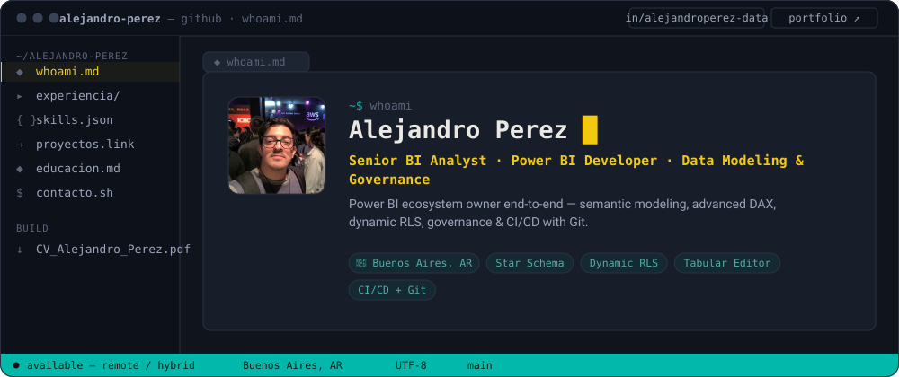
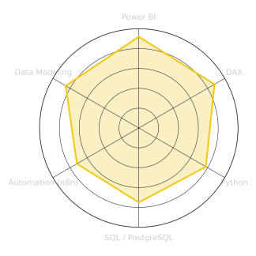

<!-- Animated terminal banner, generated by scripts/build_terminal_banner.py from assets/avatar.png -->
<picture>
  <source media="(prefers-color-scheme: dark)"  srcset="assets/banner-dark.svg">
  <source media="(prefers-color-scheme: light)" srcset="assets/banner-light.svg">
  
</picture>

 

&nbsp;&nbsp;
&nbsp;&nbsp;
&nbsp;&nbsp;

  

---

## This is me :)

Hi, I'm **Alejandro**, a BI Developer based in Buenos Aires, Argentina.

- 📊 I design and build **Power BI** semantic models and reports end-to-end — data modeling, DAX, RLS, deployment.
- 🐍 I script the parts Power BI can't: **Python** for data prep, validation and one-off pipelines.
- ⚙️ I automate recurring workflows with **n8n** so data keeps moving without me babysitting it.
- 🗄️ Comfortable with **PostgreSQL** and **SQL** for anything that needs to live outside the model.
- 🌱 Currently tinkering with personal automation projects that connect the tools I use day to day.

 

## Stack

 
&nbsp;
&nbsp;

---

## Skill radar

<!-- Self-rated - edit assets/skills.json, the "Skill radar" workflow redraws it -->
<picture>
  <source media="(prefers-color-scheme: dark)"  srcset="assets/radar-dark.svg">
  <source media="(prefers-color-scheme: light)" srcset="assets/radar-light.svg">
  
</picture>

---

## GitHub stats

<!-- Generated by the "Metrics" workflow via lowlighter/metrics -->
 

---

Built with ☕ and too many Power BI tabs open

